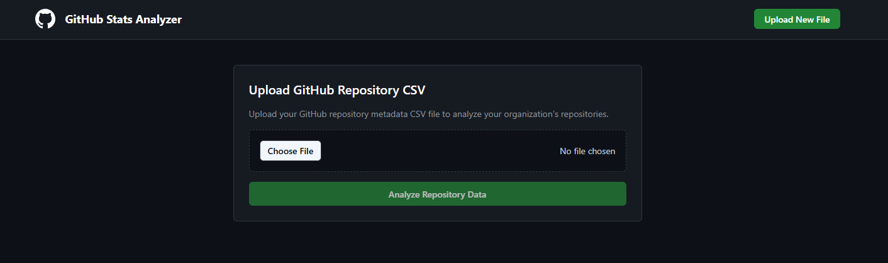
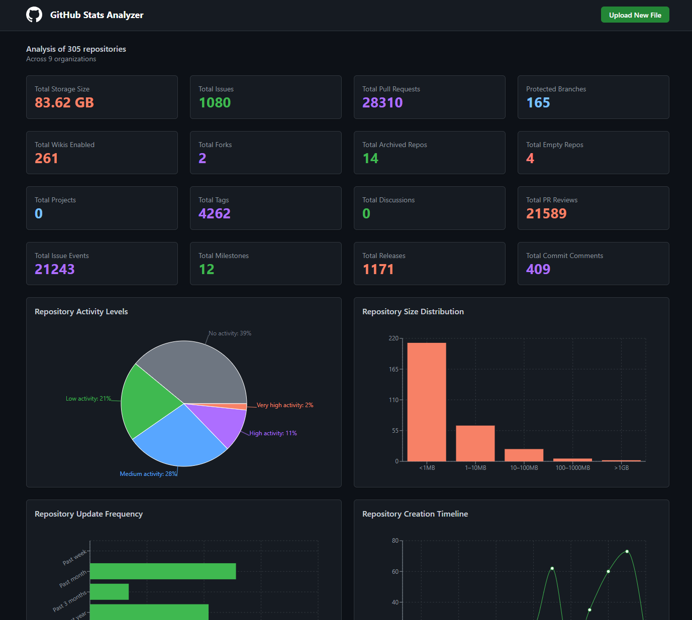

# GitHub Stats Visualizer

A static web application that visualizes GitHub statistics and collaboration patterns. Try it [here](https://mona-actions.github.io/gh-stats-visualizer)

<!-- Option 1: Local image (recommended) -->





## Features

- 📊 Interactive dashboard with multiple visualization types
- 📈 Time-based analysis of repository activity
- 👥 Collaboration pattern insights
- 🎨 Modern, responsive UI
- ⚡ Fast performance with Vite, React and Typescript

## Getting Started

1. Clone the repository
2. Install dependencies:
   ```bash
   npm install
   ```
3. Start the development server:
   ```bash
   npm run dev
   ```
4. Open [http://localhost:5173](http://localhost:5173) in your browser

## Adding a New Dashboard Chart

The application is designed to be easily extensible. Here's how to add a new chart component:

1. Add your chart component to `src/components/Dashboard/Components.tsx`:
   ```typescript
   // Inside src/components/Dashboard/Components.tsx
   
   // Add your chart component
   function NewChart({ data }: ChartProps) {
     return (
       <div className="chart-container">
         {/* Your chart implementation */}
       </div>
     );
   }
   
   // Add it to the DashboardComponents object
   export const DashboardComponents = {
     // ... existing components
     newChart: NewChart,
   };
   ```

2. The chart will automatically be available in the dashboard through the `DashboardComponents` object.

3. Style your chart using the shared styles in `src/styles.ts`

### Available Chart Types

The application provides several generic chart components that you can use:

1. **Bar Chart** (`GenericBarChart`)
   ```typescript
   interface BarChartProps {
     title: string;
     data: { name: string; value: number }[];
     bars: { dataKey: string; name: string; fill: string }[];
     formatter?: (value: ValueType) => string;
     XAxisProps?: object;
   }
   ```

2. **Pie Chart** (`GenericPieChart`)
   ```typescript
   interface PieChartProps {
     title: string;
     data: { name: string; value: number }[];
     colors: string[];
     formatter?: (value: ValueType) => string;
   }
   ```

3. **Line Chart** (`GenericLineChart`)
   ```typescript
   interface LineChartProps {
     title: string;
     data: { name: string; value: number }[];
     lines: { dataKey: string; name: string; stroke: string }[];
     formatter?: (value: ValueType) => string;
   }
   ```

4. **Table** (`GenericTable`)
   ```typescript
   interface TableProps {
     title: string;
     data: any[];
     columns: { key: string; label: string; render?: (value: any) => ReactNode }[];
     limit?: number;
     fullWidth?: boolean;
   }
   ```

### Chart Component Guidelines

- Use TypeScript for type safety
- Follow the existing chart component patterns
- Implement responsive design
- Include loading and error states
- Add tooltips for data points
- Use the shared color palette from `CHART_COLORS`

## Project Structure

```
.
├── src/
│   ├── components/
│   │   ├── Charts/             # Chart visualization components
│   │   │   ├── Bar.tsx         # Bar chart component
│   │   │   ├── Line.tsx        # Line chart component
│   │   │   ├── Pie.tsx         # Pie chart component
│   │   │   ├── Table.tsx       # Table visualization
│   │   │   ├── Utils.tsx       # Shared chart utilities
│   │   │   └── index.ts        # Chart exports
│   │   ├── Dashboard/          # Dashboard components
│   │   │   └── Visualization.tsx  # Dashboard layout and components
│   │   ├── Dashboard.tsx       # Main dashboard container
│   │   ├── Footer.tsx          # Application footer
│   │   ├── GitHubLogo.tsx      # GitHub logo component
│   │   ├── Header.tsx          # Application header
│   │   └── Upload.tsx          # File upload component
│   ├── utils/
│   │   ├── calculateStats.ts   # Statistics calculation utilities
│   │   ├── generateTestData.ts # Test data generation
│   │   └── parseCsv.ts         # CSV parsing utilities
│   ├── App.tsx                 # Main application component
│   ├── main.tsx               # Application entry point
│   ├── styles.ts              # Shared styles
│   └── types.ts               # TypeScript type definitions
├── public/                    # Static assets
├── index.html                # HTML entry point
├── package.json              # Project dependencies
├── tsconfig.json            # TypeScript configuration
└── vite.config.ts           # Vite configuration
```

## Contributing

1. Fork the repository
2. Create a feature branch
3. Commit your changes
4. Push to the branch
5. Create a Pull Request

## License

MIT License - feel free to use this project for your own purposes.

## Credits

Built with ❤️ by the :octocat: Expert Services Team